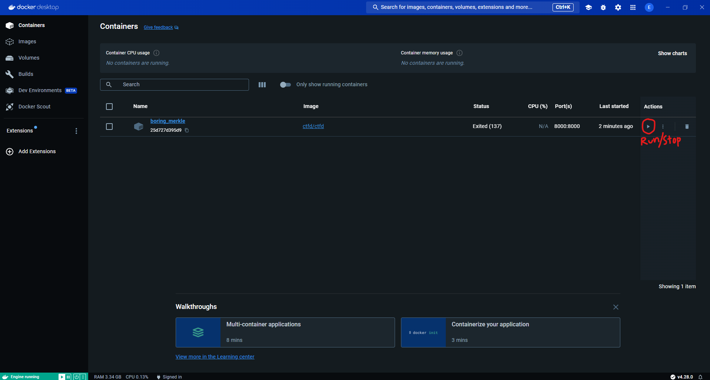
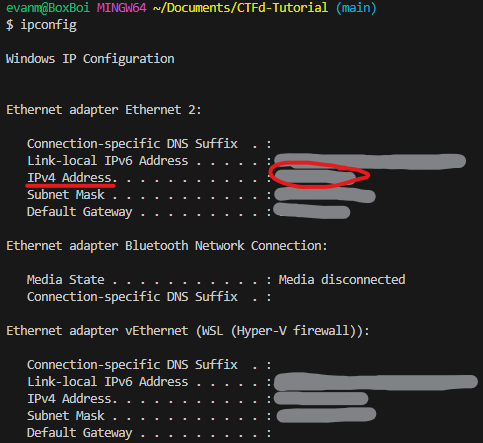

# Table of Contents
1. [Introduction](#introduction)
2. [Installation](#installation)
3. [Hosting Locally](#hosting-locally)
4. [Self Hosting](#hosting-locally)
5. [Setup](#setup)

# Introduction

This tutorial will guide you through the steps of setting up a CTFd server. The CTFd code can be found [here](https://github.com/CTFd/CTFd). Online documentation can be found here [here](https://docs.ctfd.io).

You have a few options when it comes to hosting:

1. You can host 100% free locally, allowing anyone on your network to access your CTF.

2. You can also self host publicly, but you will need your own computer to use as a server, and will need to pay if you want a fancy domain name. This is also a fairly complicated option.

3. The easist option to host publicly is through CTFd. The downside is this should will $10 monthly.

If you want to host through CTFd, you can skip to [Hosting Remotely Through CTFd](#hosting-remotely-through-ctfd).

If you want to host yourself through options 1 and 2, continue to the installation section.

# Installation

The first step is to clone this repository. If you are new to using SSH, you can access [this](https://docs.github.com/en/authentication/connecting-to-github-with-ssh/managing-deploy-keys#set-up-deploy-keys) tutorial for help setting up a key.

Clone this repository with the following command (if you have python 3 and python 2 installed, you might need to use pip3):
```sh
git clone https://github.com/evanmarlo/CTFd-Tutorial.git
```
Change directories into the submodule:
```sh
cd CTFd
```
Clone the CTFd submodule:
```
git submodule init
git submodule update
```
Then install dependencies (might take a minute):
```sh
pip install -r requirements.txt
```

Next, you will need to install Docker [here](https://docs.docker.com/install/).

If your do not already have Docker Compose installed, install it [here](https://docs.docker.com/compose/install/).

# Hosting Locally
Start Docker with the following command:
```
docker run -p 8000:8000 -it ctfd/ctfd
```

While docker is running, open up the following URL in a web browser:
http://localhost:8000/setup

From there you can follow the [Setup](#setup) instructions to setup your CTF. When you are done you can close the container through the terminal by pressing control + c. You can also run and close your container through the docker desktop app. This is how you will save changes to your CTF. See the screenshot below.



In order for to share your CTF with other devices on your network, you will need to know your IP address. If you are on Windows and don't know your machine's IP address already, run the following:
```
ipconfig
```
If you are on Mac or Linux, use the ```ifconfig``` command. Your IP address will be at "IPv4 Address". Here is a screenshot example:



Then, share the following link, replacing "ipaddress" with your own IP address: http://ipaddress:8000

For example, if my IP address were 123.45.678.9, I would share the link http://123.45.678.9:8000.

From here, if you all you want to do is host locally, you can skip to the [Setup](#setup) section.

# Self Hosting

First, you will want a (probably Linux) machine to act as your server and run your server.

Your first step to self hosting will be getting a domain name. You can usually get a domain name fairly cheap through a registrar. I can't recomend one specifically but some examples you can use are Wix, GoDaddy, Mailchimp, or AWS.

If you are really interested in setting up the domain name yourself, here is an article that details how you may do that: https://blog.technitium.com/2022/06/how-to-self-host-your-own-domain-name.html

Once you have your domain name setup, you can host it with docker. Here is a useful [repo](https://github.com/3Nigma/dsdr-setup) that comes with an article that details how to host with docker.

# Hosting Remotely Through CTFd


# Setup